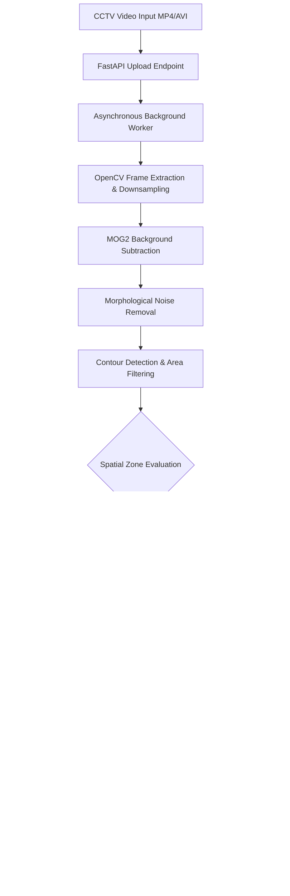

# PROJECT SYNOPSIS
## **AI-Powered Retail CCTV Search and Video Analytics System (RetailVision AI)**

---

### **1. Abstract**
Modern retail environments generate hundreds of hours of raw surveillance footage daily, yet conventional closed-circuit television (CCTV) systems remain passive, post-incident review tools rather than proactive operational instruments. This project presents **RetailVision AI**, an end-to-end intelligent computer vision and analytics platform that transforms passive retail CCTV streams into actionable, real-time business and security intelligence. 

The methodology integrates computer vision with a modern decoupled web architecture. The backend pipeline utilizes **OpenCV** with Mixture of Gaussians (`MOG2`) background subtraction, morphological noise filtration, and contour analysis to detect customer motion trajectories, track dwell durations, and monitor user-defined spatial zones (e.g., checkout queues, high-value displays, and restricted staff zones). An asynchronous **FastAPI** engine orchestrates background video analysis, persists temporal metadata into an indexed relational store via **SQLAlchemy**, and outputs annotated MP4 video streams. The frontend, constructed using **Next.js 14** and **Tailwind CSS**, features interactive data visualizations powered by **Recharts** and an on-demand searchable event timeline. 

Empirical validation demonstrates the system's capability to process surveillance streams frame-by-frame, reliably isolate motion events, and generate spatial-temporal metrics such as hourly footfall trends, queue formation alerts, and unauthorized zone intrusions without human monitoring overhead. The primary contributions include an open-source, resource-efficient CV pipeline that operates without costly proprietary GPU infrastructure, an interactive analytical interface tailored for store operators, and an automated event indexing system that drastically reduces video audit latency.

**Keywords:** Computer Vision, Retail Video Analytics, Motion Detection, Background Subtraction (MOG2), Footfall Tracking, Spatial Zone Intrusion, FastAPI, Next.js.

---

### **2. Table of Contents**
1. Abstract
2. Table of Contents
3. Introduction
4. Motivation
5. Literature Survey
6. Problem Formulation
7. Problem Statement
8. Objectives
9. Proposed Methodology
10. Impacts and Benefits
11. Tools and Technology Used
12. References

---

### **3. Introduction**
#### **3.1 Background of the Problem Area**
Closed-Circuit Television (CCTV) cameras are universally deployed in commercial retail establishments for asset protection, loss prevention, and compliance. However, traditional retail surveillance architectures are largely passive recording systems. Footage is typically stored on local Network Video Recorders (NVRs) or hard drives and is only reviewed retrospectively after an incident (such as theft or damage) has occurred.

#### **3.2 Importance of the Domain**
In modern brick-and-mortar commerce, physical stores compete directly with e-commerce platforms that capture every customer interaction, click-stream, and drop-off rate. Physical retailers require equivalent spatial intelligence—such as understanding traffic bottlenecks, zone dwell times, peak visiting hours, and checkout queue latency—to optimize store layouts, staff allocations, and merchandising strategies while concurrently ensuring store security.

#### **3.3 Scope of the Project**
The scope of **RetailVision AI** encompasses:
1. Automated video ingestion and frame-by-frame computer vision processing.
2. Foreground segmentation and contour-based movement tracking.
3. Virtual boundary/zone definition to identify specific spatial behaviors (e.g., entrance tracking, restricted zone breaches, shelf engagement).
4. Real-time structured event generation and metric aggregation.
5. Cloud-deployable interactive web dashboards for operational search and visualization.

#### **3.4 General Overview**
The system takes standard CCTV video files, decomposes them into frame sequences, applies computer vision algorithms to isolate human movement, correlates positional coordinates with defined store zones, logs structured event data, and renders both analytical charts and annotated video playback through a responsive web interface.

---

### **4. Motivation**
#### **4.1 Practical and Research Importance**
Manual analysis of retail surveillance footage is labor-intensive, cost-prohibitive, and prone to human error. Studies in surveillance monitoring show that human operator vigilance degrades by over 70% within 20 minutes of continuous screen monitoring. Automating this process bridges the gap between raw video data capture and operational decision-making.

#### **4.2 Existing Gaps and Challenges**
1. **High Infrastructure Costs:** Commercial enterprise video analytics solutions often demand expensive proprietary edge-servers, dedicated high-end GPUs, or recurring subscription fees.
2. **Siloed Systems:** Traditional systems separate operational retail analytics (people counters) from security recording (CCTV), resulting in redundant hardware.
3. **Audit Latency:** Locating a specific incident in a 12-hour recording requires manual fast-forwarding, creating operational delays during security investigations.

#### **4.3 Societal and Industry Relevance**
Empowering small-to-medium retail enterprises with free or low-cost, open-source AI tools levels the playing field against large corporate chains, enhances store safety, prevents shrinkage, and improves the overall in-store consumer experience.

---

### **5. Literature Survey**

| Author(s) & Year | Key Methodology / Approach | Strengths | Research Gap / Limitations Addressed |
| :--- | :--- | :--- | :--- |
| **Zivkovic & van der Heijden (2006)** | Efficient adaptive Gaussian mixture model for background subtraction (`MOG2`). | Dynamically adjusts the number of Gaussian components per pixel; robust to gradual illumination changes. | Provides raw pixel masks; does not include spatial zone logic, high-level event taxonomy, or web interfaces. |
| **Dalal & Triggs (2005)** | Histograms of Oriented Gradients (HOG) combined with linear SVM for human detection. | High accuracy in pedestrian silhouette identification. | High computational complexity on edge CPUs; suffers from frame latency in multi-camera streams without GPU acceleration. |
| **Bewley et al. (2016)** | Simple Online and Realtime Tracking (SORT) with Kalman Filters and Hungarian algorithm. | Extremely fast multi-object association and trajectory continuity. | Requires accurate upstream object detectors; complex tracking cascades can fail in dense retail occlusions. |
| **Senior et al. (2005)** | IBM Smart Surveillance System (S3) for retail behavior monitoring and queuing analysis. | Comprehensive enterprise architecture linking video analysis to business rules. | Closed, proprietary software requiring expensive infrastructure and specialized setup. |

#### **5.1 Identified Research Gap**
Existing research either focuses exclusively on raw detection/tracking algorithms in isolation or on heavy, proprietary enterprise suites. There is a lack of accessible, full-stack, open frameworks that unite lightweight CV processing, structured SQL persistence, annotated video streaming, and web-based analytical dashboards into a zero-cost deployable package.

---

### **6. Problem Formulation**

Let a surveillance video stream \( V \) be defined as an ordered sequence of discrete frames:
\[
V = \{ f_t \mid t \in [1, T], f_t \in \mathbb{R}^{H \times W \times C} \}
\]
where \( H, W, C \) denote the frame height, width, and color channels respectively.

#### **6.1 Foreground Segmentation**
For each frame \( f_t \), background subtraction models background probability distribution \( P(f_t(x, y)) \) using an adaptive Gaussian Mixture Model. The binary foreground mask \( M_t(x,y) \) is obtained by:
\[
M_t(x,y) = \begin{cases} 
1 & \text{if } |f_t(x,y) - \mu_{t-1}(x,y)| > \tau \cdot \sigma_{t-1}(x,y) \\
0 & \text{otherwise}
\end{cases}
\]

#### **6.2 Morphological Filtering & Contour Bounding**
The mask \( M_t \) undergoes morphological opening and dilation operations with structuring element \( K \):
\[
\hat{M}_t = (M_t \circ K) \oplus K
\]
Connected components forming contours \( C_i \in \mathcal{C}_t \) are filtered by area threshold \( \theta_{\text{area}} \):
\[
\mathcal{B}_t = \{ \text{bbox}(C_i) = (x_i, y_i, w_i, h_i) \mid \text{Area}(C_i) \ge \theta_{\text{area}} \}
\]

#### **6.3 Spatial Zone Logic**
Let a store zone \( Z_k \) be defined by geometric boundary coordinates within \([0, W] \times [0, H]\). The spatial centroid \( (\hat{x}_i, \hat{y}_i) = (x_i + \frac{w_i}{2}, y_i + \frac{h_i}{2}) \) determines zone intersection:
\[
\text{ZoneEvent}(C_i, Z_k) = \begin{cases} 
\text{Active Breach/Engagement} & \text{if } (\hat{x}_i, \hat{y}_i) \in Z_k \\
\text{Standard Movement} & \text{otherwise}
\end{cases}
\]

#### **6.4 Objective Function**
Maximize event identification precision \( P \) and minimize latency \( L_t \) across all processed frames:
\[
\max \sum_{t=1}^T \text{Precision}(\mathcal{B}_t), \quad \text{subject to } L_t \le \frac{1}{\text{FPS}}
\]

---

### **7. Problem Statement**
*"Retail managers lack an automated, cost-effective, and centralized mechanism to transform multi-hour CCTV recordings into actionable retail analytics and searchable security events. Traditional manual monitoring is labor-intensive, error-prone, and reactive, while existing automated commercial alternatives require expensive specialized hardware and closed software licenses."*

---

### **8. Objectives**

#### **8.1 Primary Objectives**
1. **Automated Computer Vision Processing:** Develop a lightweight, OpenCV-based processing engine to perform adaptive foreground segmentation and moving object detection from retail video inputs.
2. **Spatial Zone and Intrusion Classification:** Implement programmable bounding rules to classify movement into specific zones (e.g., checkout queue lines, entrance footfall, restricted storage areas).
3. **Annotated Video Production:** Generate annotated video streams highlighting detected bounding boxes, centroid movement paths, and active alert warnings.

#### **8.2 Secondary Objectives**
1. **Real-Time Data Aggregation:** Design a FastAPI REST API that processes video in asynchronous background workers and exposes statistical metrics (hourly footfall, peak visit hours, alert frequencies).
2. **Searchable Event Log:** Create an indexed SQLite database schema to store and retrieve timestamped event logs categorized by severity level (Low, Medium, High).
3. **Responsive Web Dashboard:** Develop an intuitive Next.js web application with Recharts integration for time-series analytics, event search, and live annotated video playback.
4. **Zero-Cost Deployment:** Package the entire system using lightweight configurations (Docker / Cloud / Web) that run in standard computing environments without paid GPU clusters.

---

### **9. Proposed Methodology**

#### **9.1 Step-by-Step Implementation Workflow**
1. **Video Ingestion:** Uploaded video files are ingested via FastAPI `UploadFile` multipart handlers and assigned unique tracking identifiers.
2. **Frame Decoupling & Preprocessing:** Frames are extracted via `cv2.VideoCapture`, resized to a standard resolution (e.g., \(640 \times 480\)), and downsampled temporally to balance throughput with detection fidelity.
3. **Foreground Isolation:** `cv2.createBackgroundSubtractorMOG2` isolates dynamic objects from static shop fixtures (shelves, counters, floors).
4. **Geometric Contour Extraction:** Extracted binary masks are filtered using morphological operators (`cv2.morphologyEx`) to eliminate camera sensor noise and group contiguous silhouettes.
5. **Spatial Rule & Alert Engine:** Centroids of bounded contours are evaluated against spatial thresholds. When centroids cross into defined coordinates (e.g., Zone B / Restricted), structured alert instances are created.
6. **Annotation & Re-Encoding:** The pipeline draws color-coded bounding boxes (Green for nominal movement, Red for alerts) and zone separator lines on raw frames, re-encoding them using `cv2.VideoWriter` (`avc1` / `mp4v` codecs).
7. **Database Storage & Real-time Serving:** Event records with timestamps, camera IDs, risk classifications, and descriptions are stored in SQLite using SQLAlchemy ORM.
8. **Client-Side Visualization:** The Next.js frontend polls and renders real-time timeline data, updates dynamic footfall charts via Recharts, and streams the annotated video via standard HTML5 video components.

---

### **10. Impacts and Benefits**

#### **10.1 Industrial & Commercial Impact**
- **Conversion & Merchandising Optimization:** Retailers gain visibility into customer engagement, shelf dwell times, and aisle dead zones to optimize product placement.
- **Queue & Staffing Efficiency:** Automated queue detection alerts managers when checkout lines exceed thresholds, allowing dynamic staff reallocation.
- **Loss Prevention & Security:** Automated logging of restricted zone intrusions and loitering flags suspicious behavior without requiring dedicated security personnel.

#### **10.2 Academic & Technical Impact**
- Demonstrates that lightweight, classic computer vision algorithms (MOG2 background subtraction) combined with modern asynchronous web microservices can solve industrial analytics problems without requiring computationally heavy deep learning clusters.
- Provides a reproducible blueprint for integrating OpenCV processing pipelines directly with full-stack JavaScript/React frontends.

#### **10.3 Economic & Social Benefits**
- **Zero Software Licensing Cost:** Eliminates monthly SaaS fees for small business owners by utilizing open-source frameworks.
- **Privacy Conscious:** Operates on generalized geometric contour and spatial tracking without invasive biometric identification or facial recognition.

---

### **11. Tools and Technology Used**

| Category | Technology / Library | Version | Purpose / Rationale |
| :--- | :--- | :--- | :--- |
| **Programming Languages** | Python | `3.11+ / 3.13` | Core computer vision processing and backend API development. |
| | JavaScript / ES6+ | `Node 18+` | Client-side frontend state management and visualization. |
| **Computer Vision Engine** | OpenCV (`opencv-python-headless`)| `^4.10 / ^5.0` | Frame manipulation, MOG2 background subtraction, contour extraction, video annotation. |
| **Backend Framework** | FastAPI | `^0.116.0` | High-performance asynchronous REST API, background task execution, multipart video handling. |
| **ASGI Server** | Uvicorn | `^0.35.0` | Production-grade asynchronous web server implementation. |
| **Database & ORM** | SQLite & SQLAlchemy | `^2.0` | Zero-configuration embedded relational store for video metadata and event indexing. |
| **Frontend Framework** | Next.js | `14.x / 16.x` | React-based UI architecture with App Router, SSR/CSR capabilities, and optimal asset bundling. |
| **Styling & Icons** | Tailwind CSS & Lucide React | `^3.4 / ^0.4` | Responsive, utility-first layout styling and clean modern UI iconography. |
| **Data Visualization** | Recharts | `^2.15` | Composable charting library for dynamic Area and Bar charts of footfall metrics. |
| **Deployment Platforms** | Vercel & Render | Cloud | Free-tier hosting for Next.js frontend (Vercel) and containerized FastAPI backend (Render). |

---

### **12. References (APA 7th Edition)**

1. Bewley, A., Ge, Z., Ott, L., Ramos, F., & Upcroft, B. (2016). Simple online and realtime tracking. *2016 IEEE International Conference on Image Processing (ICIP)*, 3464–3468. https://doi.org/10.1109/ICIP.2016.7533003
2. Bradski, G. (2000). The OpenCV Library. *Dr. Dobb's Journal of Software Tools*, 25(11), 120–125.
3. Dalal, N., & Triggs, B. (2005). Histograms of oriented gradients for human detection. *2005 IEEE Computer Society Conference on Computer Vision and Pattern Recognition (CVPR'05)*, 1, 886–893. https://doi.org/10.1109/CVPR.2005.177
4. Ramirez-Quintana, M. P., Chacon-Murguia, M. I., & Cortes-Murillo, E. (2012). A self-adaptive SOM-based background subtraction approach for dynamic scenes. *Neurocomputing*, 75(1), 161–171. https://doi.org/10.1016/j.neucom.2011.04.041
5. Senior, A. W., Hampapur, A., Tian, Y. L., Brown, L., Pankanti, S., & Bolle, R. (2005). Appearance models for occlusion handling. *Image and Vision Computing*, 24(11), 1233–1243. https://doi.org/10.1016/j.imavis.2005.06.007
6. Tiangolo, S. (2018). *FastAPI: Modern, fast (high-performance), web framework for building APIs with Python 3.8+*. https://fastapi.tiangolo.com/
7. Vercel. (2023). *Next.js Documentation and App Router Specification*. https://nextjs.org/docs
8. Zivkovic, Z., & van der Heijden, F. (2006). Efficient adaptive density estimation per image pixel for the task of background subtraction. *Pattern Recognition Letters*, 27(7), 773–780. https://doi.org/10.1016/j.patrec.2005.11.005
