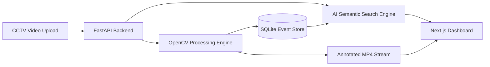

# 🎥 RetailVision AI — Smart Retail CCTV Search & Video Analytics

[](https://retail-cctv-analytics.vercel.app)
[](https://retail-cctv-analytics-backend.onrender.com)
[](https://nextjs.org/)
[](https://fastapi.tiangolo.com/)
[](https://opencv.org/)

An intelligent computer vision platform that turns passive CCTV footage into actionable business intelligence for retail spaces. Inspired by state-of-the-art surveillance systems like **SmartSurv**, **RetailVision AI** introduces **Natural Language Video Search**, real-time foot traffic analytics, automated security alerts, and an executive AI daily brief.

---

## 🌟 Key Highlights

- 🧠 **SmartSurv-Inspired Natural Language Video Search**: Type natural plain-English queries (e.g., *"loitering near shelf"*, *"intrusion in Zone B"*, *"queue forming"*) to instantly query and filter video events with AI relevance match percentages.
- 🤖 **AI Daily Incident Brief**: Automated executive summary generator synthesizing daily customer movement, intrusion alerts, and peak traffic hours.
- ⚡ **Real-Time Motion & Person Detection**: Leverages OpenCV background subtraction (`cv2.createBackgroundSubtractorMOG2`) and contour tracking to trace customer movement.
- 🎯 **Configurable Zone & Intrusion Monitoring**: Automatically flags dwell time and restricted-area entries (e.g., Staff-Only zones, Cash Counters, Checkout aisles).
- 📊 **Interactive Retail Analytics**: Recharts visualizations displaying hourly visitor volume, peak traffic hours, and zone dwell breakdowns.
- 🎞️ **Annotated Video Streaming**: Automatically processes, overlays bounding boxes, and streams annotated MP4 video feeds directly through a high-performance FastAPI streaming endpoint.
- ☁️ **Full-Stack Cloud Architecture**: Modern Next.js frontend deployed on Vercel with an asynchronous FastAPI engine hosted on Render.

---

## 🚀 Live Demos & Links

| Service | Link | Status |
| :--- | :--- | :--- |
| **🌐 Interactive Dashboard** | [retail-cctv-analytics.vercel.app](https://retail-cctv-analytics.vercel.app) | `Live Production` |
| **⚙️ REST & Streaming API** | [retail-cctv-analytics-backend.onrender.com](https://retail-cctv-analytics-backend.onrender.com) | `Active` |
| **📖 API Documentation** | [Swagger / OpenAPI Docs](https://retail-cctv-analytics-backend.onrender.com/docs) | `Interactive` |

---

## 🛠️ Architecture & Tech Stack



### **Frontend**
- **Framework**: Next.js 14 (App Router)
- **Styling**: Tailwind CSS & Lucide Icons
- **Data Visualizations**: Recharts (Dynamic Area & Bar Charts)
- **Deployment**: Vercel

### **Backend & Computer Vision**
- **API Framework**: FastAPI & Uvicorn (Asynchronous REST API)
- **Vision Engine**: OpenCV (`opencv-python-headless`) for frame-by-frame analysis
- **Search Engine**: Natural language query parser & semantic intent matching
- **Database / ORM**: SQLite & SQLAlchemy
- **Deployment**: Render (Docker / Python Container)

---

## 💻 Local Quickstart

### 1. Clone the Repository
```bash
git clone https://github.com/Vaishnavi-khatri2005/retail-cctv-analytics.git
cd retail-cctv-analytics
```

### 2. Launch Backend (FastAPI + OpenCV)
```bash
cd backend
python -m venv venv
# Windows:
.\venv\Scripts\activate
# macOS/Linux:
source venv/bin/activate

pip install -r requirements.txt
python -m uvicorn main:app --reload --port 8000
```
Backend will be live at `http://localhost:8000` (Swagger docs at `http://localhost:8000/docs`).

### 3. Launch Frontend (Next.js)
```bash
cd ../frontend
npm install
npm run dev
```
Open **[http://localhost:3000](http://localhost:3000)** to view the dashboard!

---

## 📸 Core Capabilities

1. **Natural Language CCTV Search**: Search surveillance events by conversational description (*"loitering"*, *"zone breach"*, *"crowd"*).
2. **AI Daily Executive Brief**: Instant briefing modal summarizing high-risk alerts and traffic flow.
3. **Background Processing**: The computer vision model processes frames, records footfall statistics, and identifies zone violations.
4. **Stream Annotated Output**: View the processed video directly within the dashboard with active detection boxes and zone overlays.

---

## 📄 License & Attribution

Distributed under the MIT License. Developed for intelligent retail space surveillance and customer behavior analytics.
