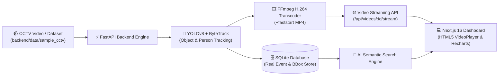

# 🎥 RetailVision AI — Smart Retail CCTV Search & YOLO Video Analytics

[](https://shake-layout-ton-gardens.trycloudflare.com)
[](https://shake-layout-ton-gardens.trycloudflare.com/docs)
[](https://cloud.google.com/run)
[](https://github.com/ultralytics/ultralytics)
[](https://nextjs.org/)
[](https://www.docker.com/)

An intelligent retail computer vision & analytics platform that transforms passive surveillance video into real-time business intelligence and loss-prevention insights. 

Powered by **Ultralytics YOLOv8**, **ByteTrack Multi-Object Tracking**, **OpenCV**, and a unified **FastAPI + Next.js 16** architecture, **RetailVision AI** delivers verified object detection, natural language incident search, automated security alerts, precision event evidence playback, and hourly footfall analytics.

---

## 🚀 Live Application & API

| Service | Link | Description |
| :--- | :--- | :--- |
| **🌐 Interactive Dashboard** | **[shake-layout-ton-gardens.trycloudflare.com](https://shake-layout-ton-gardens.trycloudflare.com)** | Full dashboard with live YOLO video playback |
| **📖 REST & Streaming API** | **[Swagger / OpenAPI Documentation](https://shake-layout-ton-gardens.trycloudflare.com/docs)** | Interactive API test console & endpoints |
| **🎥 Video Stream Endpoint** | `GET /api/videos/{video_id}/stream` | Direct H.264 byte-range video streaming |

---

## 🌟 Key Highlights

- 🧠 **SmartSurv-Inspired Natural Language Video Search**: Search surveillance footage in plain English (*"loitering near jewelry showcase"*, *"unauthorized backroom intrusion"*, *"billing queue bottleneck"*) with AI semantic match scoring.
- ⚡ **Real YOLOv8 Object Detection & ByteTrack**: Replaces synthetic boxes with real deep-learning detection (`person`, `handbag`, `bottle`, etc.), unique tracking IDs, and model confidence scores.
- ⏱️ **Precision Event Playback / Evidence HUD**: Jump directly to **10 seconds before an incident occurs** and review continuous looped evidence windows.
- 📁 **Direct CCTV Dataset Ingestion**: Load and process real retail surveillance datasets from `backend/data/sample_cctv/` or upload custom footage.
- 🎞️ **Browser-Native H.264 Transcoding**: Uses FFmpeg (`imageio-ffmpeg`) with `+faststart` so annotated videos play smoothly across Chrome, Edge, Safari, and mobile browsers without black-screen errors.
- 📊 **Interactive Retail Analytics**: Dynamic Recharts visualizations showing hourly visitor trends, zone dwell times, and perimeter status.
- 🤖 **AI Daily Executive Brief**: Instant executive briefing synthesizing daily foot traffic, customer dwell times, and high-risk security triggers.
- ☁️ **Google Cloud Platform (GCP Cloud Run) Ready**: Multi-stage unified Docker container with Cloud Build CI/CD support.

---

## 🛠️ Architecture & Tech Stack


```mermaid
flowchart LR
    A["📹 CCTV Video / Dataset\n(backend/data/sample_cctv)"] --> B["⚡ FastAPI Backend Engine"]
    B --> C["🤖 YOLOv8 + ByteTrack\n(Object & Person Tracking)"]
    C --> D["🎞️ FFmpeg H.264 Transcoder\n(+faststart MP4)"]
    C --> E[("🗄️ SQLite Database\n(Real Event & BBox Store)")]
    D --> F["🌐 Video Streaming API\n(/api/videos/:id/stream)"]
    E --> G["🧠 AI Semantic Search Engine"]
    F --> H["💻 Next.js 16 Dashboard\n(HTML5 VideoPlayer & Recharts)"]
    G --> H
```

### **Frontend**
- **Framework**: Next.js 16 (App Router)
- **Styling**: Tailwind CSS & Lucide Icons
- **Data Visualizations**: Recharts (Interactive Area & Bar Charts)
- **Video Playback**: Custom HTML5 Player with Evidence Time Scrubbing & Looping

### **Backend & Computer Vision**
- **Framework**: FastAPI & Uvicorn (Asynchronous REST API)
- **AI / Detector**: Ultralytics YOLOv8 (`yolov8n.pt`) with ByteTrack
- **Vision Engine**: OpenCV (`opencv-python-headless`) + NumPy
- **Transcoding**: FFmpeg with `libx264`, `yuv420p`, and `+faststart`
- **Database / ORM**: SQLite & SQLAlchemy

---

## 💻 Local Quickstart

### 1. Clone the Repository
```bash
git clone https://github.com/Vaishnavi-khatri2005/retail-cctv-analytics.git
cd retail-cctv-analytics
```

### 2. Launch Backend (FastAPI + YOLOv8)
```bash
cd backend
python -m venv venv

# Windows:
.\venv\Scripts\activate
# macOS / Linux:
source venv/bin/activate

pip install -r requirements.txt
python -m uvicorn main:app --reload --port 8000
```
Backend will be live at `http://localhost:8000` (Swagger docs at `http://localhost:8000/docs`).

### 3. Launch Frontend (Next.js)
```bash
cd ../frontend
npm install
npm run dev
```
Open **[http://localhost:3000](http://localhost:3000)** in your browser!

---

## 🐳 Docker & Google Cloud Platform (GCP) Deployment

The repository includes a production-ready, multi-stage [`Dockerfile`](./Dockerfile) that builds the Next.js frontend and packages the FastAPI YOLO backend into a single container.

### Option 1: Run with Docker Compose
```bash
docker-compose up --build
```
Access the application at `http://localhost:8080`.

### Option 2: Deploy to Google Cloud Run (1 Command)
```bash
gcloud run deploy retail-cctv-analytics \
  --source . \
  --region us-central1 \
  --platform managed \
  --allow-unauthenticated \
  --memory 2Gi \
  --cpu 2 \
  --timeout 300
```

Or run the automated deployment script:
- **Windows**: `.\deploy-gcp.ps1 -ProjectId YOUR_PROJECT_ID`
- **Linux / macOS**: `./deploy-gcp.sh YOUR_PROJECT_ID`

*For comprehensive cloud deployment steps (including GCP Console Web UI & Hugging Face Spaces), see [`DEPLOYMENT.md`](./DEPLOYMENT.md).*

---

## 📸 Core Features in Action

1. **Use Sample Dataset &rarr; Run Analysis**: Loads original video from `backend/data/sample_cctv/`, detects people and objects using YOLOv8, and streams the annotated H.264 video.
2. **Precision Evidence Playback**: Click **"▶ View Evidence"** on any alert to jump directly to `-10s` before the incident.
3. **Natural Language CCTV Search**: Query store events using semantic descriptions (*"someone lingered near luxury showcase"*, *"cashier counter queue"*).
4. **AI Daily Executive Brief**: One-click summary modal synthesizing store traffic and perimeter status.

---

## 📄 License

Distributed under the MIT License. Developed for retail space surveillance, loss prevention, and customer behavior analytics.
